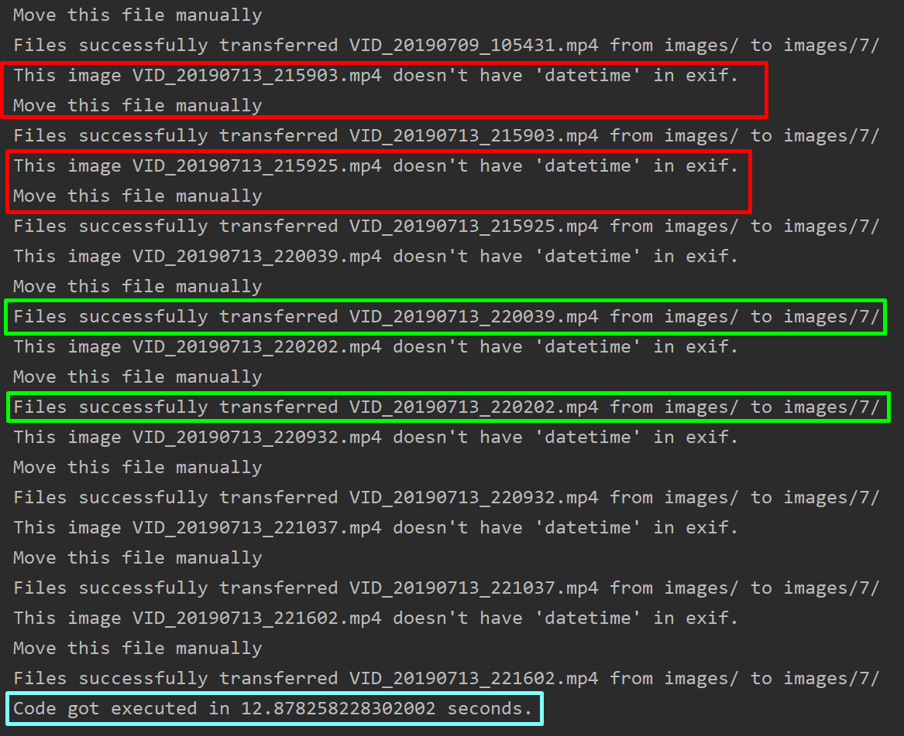

# Image Sorting Algorithm.
## Flips photos into folders by month.

If the photo was taken in August, the program will move it to a folder named '8' and then delete from the main folder.

## Screenshots

## How to use:

- Download 'main.py'
- Create a folder and move there the file 'main.py'
- Then create folder 'images'
- Inside 'images' folder create folders named from '1' to '12'

It should looks like this:

- 'folder_name'
    - main.py
    - images
        - 1
        - 2
        - 3
        - ...
        - 12

If image doesn't have datetime in exif it will be skipped and you have move it manually.

## Optimizations

1,79 GB (680) of images was transferred in 12.87 seconds 

7.18 seconds / 1 GB

0.13 GB / 1 second
## Authors

- [@DEENUU1](https://www.github.com/DEENUU1)

